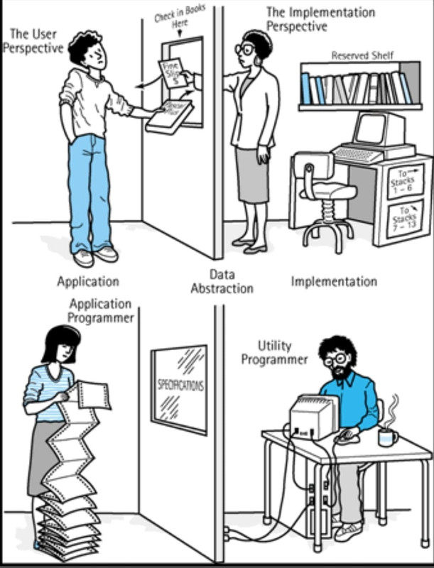

# Tính Trừu Tượng (Abstraction) trong OOP

## 1. Khái niệm

**Trừu tượng hóa (Abstraction)** là tính chất thứ ba trong bốn tính chất cơ bản của OOP. Đây là cơ chế **chỉ phơi bày ra bên ngoài những đặc điểm và chức năng thiết yếu** của một đối tượng, đồng thời **ẩn đi toàn bộ chi tiết triển khai phức tạp** bên trong.

Nói cách khác, trừu tượng hóa trả lời câu hỏi **"đối tượng này LÀM ĐƯỢC GÌ?"** chứ không quan tâm **"nó làm điều đó BẰNG CÁCH NÀO"**.

Ví dụ đời thực dễ hiểu nhất là **chiếc xe máy**: bạn chỉ cần biết vặn ga thì xe chạy, bóp phanh thì xe dừng. Bạn không cần (và không muốn) biết động cơ đốt trong hoạt động ra sao, hệ thống phanh đĩa truyền lực thủy lực thế nào. Nhà sản xuất đã **trừu tượng hóa** toàn bộ sự phức tạp đó thành một giao diện đơn giản: tay ga và cần phanh.

Trong lập trình, trừu tượng hóa được thể hiện qua hai công cụ chính: **lớp trừu tượng (abstract class)** và **giao diện (interface)**.

## 2. Phân biệt Abstraction và Encapsulation

Đây là hai khái niệm **rất dễ nhầm lẫn** vì đều liên quan đến "ẩn giấu". Cần phân biệt rõ:

| | **Abstraction (Trừu tượng)** | **Encapsulation (Đóng gói)** |
|---|---|---|
| **Ẩn cái gì?** | Ẩn **chi tiết triển khai** (cách làm) | Ẩn **dữ liệu** (trạng thái bên trong) |
| **Mục đích** | Giảm độ phức tạp, tập trung vào "làm được gì" | Bảo vệ toàn vẹn dữ liệu, kiểm soát truy cập |
| **Cấp độ** | Cấp **thiết kế** (design level) | Cấp **triển khai** (implementation level) |
| **Công cụ** | `abstract class`, `interface` | Access modifier (`private`), getter/setter |
| **Câu hỏi trả lời** | "Cái gì?" (What) | "Như thế nào?" (How — được bảo vệ) |
| **Ví dụ** | Bạn biết `rutTien()` tồn tại, không biết nó xử lý ra sao | Bạn không thể sửa trực tiếp `soDu` |

Một cách nhớ ngắn: **Abstraction ẩn sự phức tạp, Encapsulation ẩn dữ liệu.**

## 3. Hai công cụ triển khai

### a) Lớp trừu tượng (Abstract Class)

### Khi nào dùng cái nào?

| Tình huống | Chọn |
|---|---|
| Các lớp con có **quan hệ IS-A** rõ ràng và chia sẻ code chung | `abstract class` |
| Cần định nghĩa **khả năng/hành vi** mà nhiều lớp không liên quan cùng có | `interface` |
| Cần thuộc tính, constructor, trạng thái chung | `abstract class` |
| Cần một lớp mang **nhiều vai trò** cùng lúc | `interface` |

Ví dụ: `DongVat` nên là abstract class (chia sẻ `ten`, `tuoi`), còn `BietBay` nên là interface (chim biết bay, máy bay cũng biết bay — hai thứ hoàn toàn không cùng họ).
## 7. Lưu ý quan trọng

- **Abstract class không có nghĩa là vô dụng.** Nó vẫn có constructor — được gọi qua `super()` từ lớp con, dùng để khởi tạo phần trạng thái chung.
- **Một abstract class có thể không có phương thức abstract nào** (hợp lệ về cú pháp) — dùng khi bạn chỉ muốn ngăn việc khởi tạo trực tiếp.
- **Nếu lớp con không override hết** các phương thức abstract, lớp con đó cũng phải khai báo `abstract`.
- **Không kết hợp được `abstract` với `final`** hay `private` — vì abstract sinh ra để được override, còn `final`/`private` lại cấm điều đó.
- **Trừu tượng hóa quá mức cũng có hại.** Tạo interface/abstract class cho mọi thứ khi chỉ có một lớp cài đặt duy nhất chỉ làm code rối thêm. Nguyên tắc: chỉ trừu tượng hóa khi thực sự có (hoặc chắc chắn sẽ có) nhiều biến thể.

## 8. Tóm tắt

| Đặc điểm | Mô tả |
|---|---|
| Mục đích | Ẩn chi tiết triển khai, chỉ phơi bày chức năng thiết yếu |
| Trả lời câu hỏi | "Làm được gì?" chứ không phải "Làm bằng cách nào?" |
| Công cụ | `abstract class` (trừu tượng một phần), `interface` (trừu tượng hoàn toàn) |
| Từ khóa | `abstract`, `interface`, `extends`, `implements`, `@Override` |
| Lợi ích | Giảm độ phức tạp, dễ mở rộng, giảm phụ thuộc, tách biệt thiết kế và triển khai |
| Khác Encapsulation | Abstraction ẩn **sự phức tạp**; Encapsulation ẩn **dữ liệu** |
| Ví dụ đời thực | Vặn ga xe máy là xe chạy — không cần biết động cơ hoạt động ra sao |