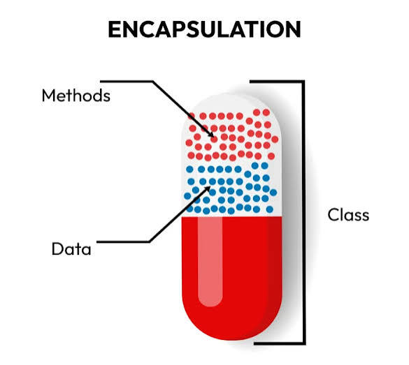
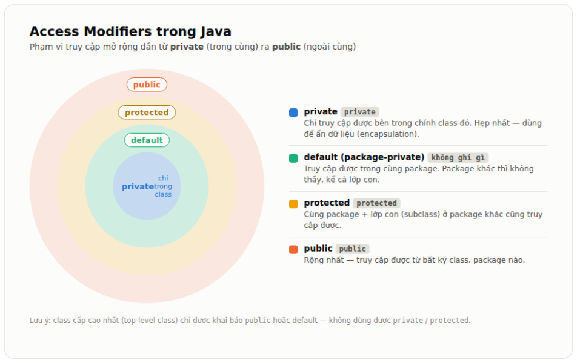

# Tính Đóng Gói (Encapsulation) trong OOP

## 1. Khái niệm

**Đóng gói (Encapsulation)** là một trong bốn tính chất cơ bản của lập trình hướng đối tượng (OOP), cùng với **Tính kế thừa (Inheritance)**, **Tính đa hình (Polymorphism)** và **Tính trừu tượng (Abstraction)**.

Đóng gói là cơ chế **gói (bundle) dữ liệu (thuộc tính)** và **các phương thức (hành vi) thao tác trên dữ liệu đó** vào chung một đơn vị duy nhất, gọi là **lớp (class)**. Đồng thời, đóng gói còn đi kèm với việc **giới hạn/che giấu quyền truy cập trực tiếp** vào dữ liệu bên trong đối tượng từ bên ngoài, chỉ cho phép truy cập thông qua các phương thức được lớp đó cung cấp công khai.

Nói cách đơn giản, đóng gói giống như một **"viên thuốc con nhộng"**: bên trong là hoạt chất (dữ liệu) và cơ chế hoạt động (logic xử lý), còn bên ngoài là lớp vỏ bảo vệ. Người dùng chỉ uống viên thuốc (gọi phương thức) chứ không can thiệp trực tiếp vào hoạt chất bên trong.

## 2. Tại sao cần đóng gói?

- **Bảo vệ dữ liệu (Data hiding):** Ngăn các đoạn code bên ngoài truy cập hoặc thay đổi dữ liệu một cách tùy tiện, gây ra trạng thái không hợp lệ cho đối tượng.
- **Kiểm soát truy cập (Validation):** Có thể kiểm tra, xác thực dữ liệu trước khi gán giá trị (ví dụ: tuổi không được âm, số dư tài khoản không được nhỏ hơn 0).
- **Tăng khả năng bảo trì:** Khi cần thay đổi cách lưu trữ hoặc xử lý dữ liệu bên trong, ta chỉ cần sửa trong lớp đó mà không ảnh hưởng đến code bên ngoài đang sử dụng lớp.
- **Giảm sự phụ thuộc (loose coupling):** Các phần khác của chương trình chỉ phụ thuộc vào giao diện (interface) công khai, không phụ thuộc vào chi tiết triển khai bên trong.
- **Tăng tính module hóa:** Mỗi lớp trở thành một "hộp đen" độc lập, dễ tái sử dụng và kiểm thử.

## 3. Cách triển khai đóng gói

Trong hầu hết các ngôn ngữ OOP (Java, C++, C#, Python...), đóng gói được thực hiện bằng cách:

1. Khai báo các thuộc tính (fields) của lớp ở mức truy cập **`private`** (hoặc tương đương) để không cho truy cập trực tiếp từ bên ngoài.
2. Cung cấp các phương thức công khai (**`public`**) dạng **getter** (lấy giá trị) và **setter** (gán giá trị) để truy cập dữ liệu một cách có kiểm soát.
3. Trong setter, có thể thêm logic kiểm tra tính hợp lệ (validation) trước khi thực sự thay đổi dữ liệu.

>- Cùng package: `protected` hoạt động giống hệt default — mọi class trong `cùng package đều thấy được`, không cần quan hệ kế thừa gì cả.
>- Khác package: chỉ có lớp con `(subclass)` mới `truy cập được` các thành viên `protected của lớp cha`, và `chỉ truy cập được` thông qua đối tượng của chính lớp con đó (hoặc this/super), chứ không truy cập được qua một đối tượng bất kỳ của lớp cha.

| Modifier | Cùng class | Cùng package | Lớp con khác package | Toàn bộ (mọi nơi) |
|---|:---:|:---:|:---:|:---:|
| `private` | ✅ | ❌ | ❌ | ❌ |
| `default` (không ghi gì) | ✅ | ✅ | ❌ | ❌ |
| `protected` | ✅ | ✅ | ✅* | ❌ |
| `public` | ✅ | ✅ | ✅ | ✅ |

>- private → class
>- default → package
>- protected → package + subclass
>- public → everywhere