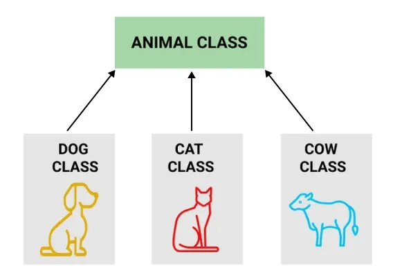

# Tính Kế Thừa (Inheritance) trong OOP


### 1. Khái niệm

**Kế thừa (Inheritance)** là tính chất thứ hai trong bốn tính chất cơ bản của OOP, cho phép một lớp (class) **tiếp nhận lại (tái sử dụng) các thuộc tính và phương thức** đã được định nghĩa ở một lớp khác, đồng thời có thể **bổ sung thêm** đặc điểm riêng hoặc **định nghĩa lại** hành vi đã có.

Các thuật ngữ:

| Tên gọi | Cách gọi khác | Vai trò |
|---|---|---|
| **Lớp cha** | superclass, base class, lớp cơ sở | Lớp cung cấp thuộc tính/phương thức chung |
| **Lớp con** | subclass, derived class, lớp dẫn xuất | Lớp nhận lại và mở rộng lớp cha |

Quan hệ mà kế thừa mô tả là quan hệ **"là một" (IS-A)**: `Cho` **là một** `DongVat`, `XeMay` **là một** `PhuongTien`, `SinhVien` **là một** `Nguoi`. Nếu câu "A là một B" nghe vô lý, thì A **không nên** kế thừa B.

Nói đơn giản, kế thừa giống như việc con cái thừa hưởng đặc điểm từ cha mẹ: nhận lại những gì đã có sẵn, rồi phát triển thêm nét riêng của mình.

## 2. Tại sao cần kế thừa?

- **Tái sử dụng code (code reuse):** Viết phần chung một lần ở lớp cha, mọi lớp con dùng lại — không phải copy-paste.
- **Tránh trùng lặp:** Khi sửa logic chung, chỉ cần sửa ở lớp cha, tất cả lớp con tự động được cập nhật.
- **Tổ chức code theo phân cấp:** Mô hình hóa thế giới thực một cách tự nhiên (Động vật → Chó, Mèo; Nhân viên → Quản lý, Nhân viên bán hàng).
- **Là nền tảng cho tính đa hình (Polymorphism):** Nhờ kế thừa, ta có thể coi một đối tượng lớp con như một đối tượng lớp cha, và gọi phương thức được override tương ứng lúc chạy.
- **Dễ mở rộng:** Muốn thêm loại mới chỉ cần viết một lớp con mới, không phải sửa code cũ (nguyên tắc Open/Closed).

## 3. Cú pháp và cơ chế

Trong Java, kế thừa dùng từ khóa **`extends`**:

```java
class LopCon extends LopCha {
    // thuộc tính, phương thức bổ sung
}
```

Ba cơ chế quan trọng đi kèm:

**a) Từ khóa `super`**

- `super(...)` — gọi constructor của lớp cha. Bắt buộc phải là **dòng đầu tiên** trong constructor lớp con. Nếu không viết, Java tự chèn `super()` (gọi constructor không tham số của lớp cha).
- `super.tenPhuongThuc()` — gọi phương thức của lớp cha (thường dùng khi override nhưng vẫn muốn tận dụng logic gốc).

**b) Ghi đè phương thức (Method Overriding)**

Lớp con định nghĩa lại một phương thức đã có ở lớp cha, với **cùng tên, cùng tham số, cùng kiểu trả về**. Nên đánh dấu bằng annotation `@Override` để trình biên dịch kiểm tra giúp.

> Phân biệt: **Overriding** (ghi đè — cùng chữ ký, ở lớp con) khác với **Overloading** (nạp chồng — cùng tên nhưng khác tham số, có thể trong cùng một lớp).

**c) Từ khóa `final`**

- `final class` — lớp không cho phép kế thừa (ví dụ `String` trong Java).
- `final method` — phương thức không cho phép lớp con override.


## 7. Lưu ý quan trọng khi dùng kế thừa

- **Kế thừa không kế thừa được gì?** Constructor không được kế thừa (phải gọi qua `super`). Thành viên `private` của lớp cha tồn tại trong đối tượng lớp con nhưng **không truy cập trực tiếp được** — phải qua getter/setter public hoặc protected.
- **Đừng lạm dụng kế thừa.** Nguyên tắc phổ biến: **"Ưu tiên composition hơn inheritance"**. Chỉ dùng kế thừa khi quan hệ thật sự là "IS-A"; nếu là quan hệ "HAS-A" (có một) thì dùng thành phần (composition) — ví dụ `Xe` **có một** `DongCo`, chứ `Xe` không kế thừa `DongCo`.
- **Kế thừa quá sâu gây khó bảo trì.** Chuỗi 5–6 tầng khiến việc truy vết logic trở nên rất khó. Thực tế nên giữ ở 2–3 tầng.
- **Kế thừa phá vỡ đóng gói một phần.** Lớp con phụ thuộc vào chi tiết cài đặt của lớp cha; sửa lớp cha có thể làm hỏng lớp con (fragile base class problem).

## 8. Tóm tắt

| Đặc điểm | Mô tả |
|---|---|
| Mục đích | Tái sử dụng code, tổ chức phân cấp, nền tảng cho đa hình |
| Từ khóa | `extends` (class), `implements` (interface), `super`, `@Override`, `final` |
| Quan hệ mô tả | IS-A (là một) |
| Java hỗ trợ | Đơn, nhiều tầng, phân cấp — KHÔNG đa kế thừa từ class |
| Lợi ích | Giảm trùng lặp, dễ mở rộng, dễ bảo trì phần chung |
| Rủi ro | Lạm dụng gây phụ thuộc chặt, phân cấp sâu khó bảo trì |
| Ví dụ đời thực | Con thừa hưởng đặc điểm từ cha mẹ; xe máy/ô tô đều là phương tiện giao thông |