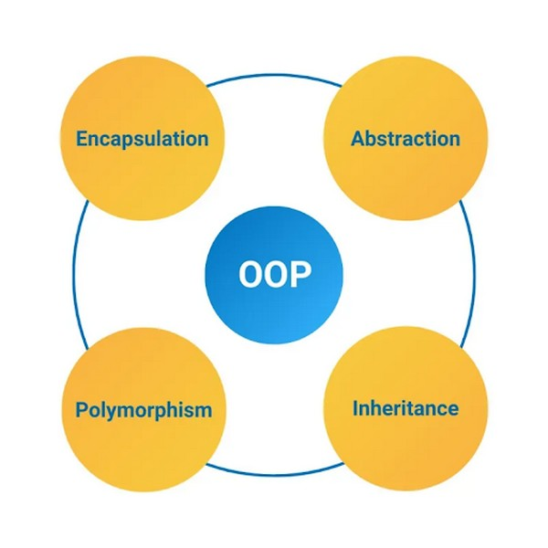

***
> Hiện nay, trên thị trường OOP được sử dụng rất nhiều và cũng được đánh giá rất cao. Hầu hết các ngôn ngữ cơ bản như: Python, Java, Ruby, .NET,... đều được hổ trợ cho lập trình hướng đối tượng OOP (Object Oriented Programming)
***

#### > Về Object: Mỗi Object đều sẽ có 2 thông tin ứng với chính nó đó là:
1. Phương thức (Method)  : Chính là các hành vi mà đối tượng đó có thể thực hiện được
2. Thuộc tính (Attribute): Các thông tin của đối tượng mà `Lập trình viên` muốn hướng đến

#### Về Class: Mỗi 1 class đều sẽ có 1 kiểu dữ liệu và nó bao gồm vô số các thuộc tính (attributes) và phương thức (methods) đã được định nghĩa trước đó. Đây được coi là sự trừu tượng của rất nhiều đối tượng.

> SỰ KHÁC NHAU GIỮA CLASS VÀ OBJECT LÀ GÌ?
>   Lớp sống 1 khuôn mẫu, còn đối tượng giống như 1 thực thể, thể hiện khuôn mẫu đó

