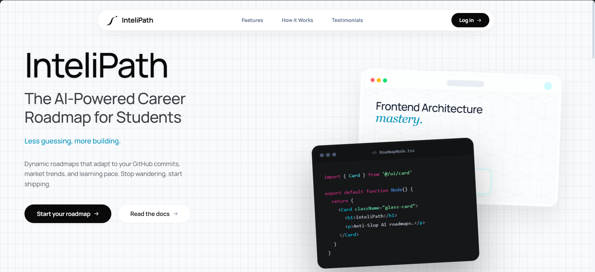
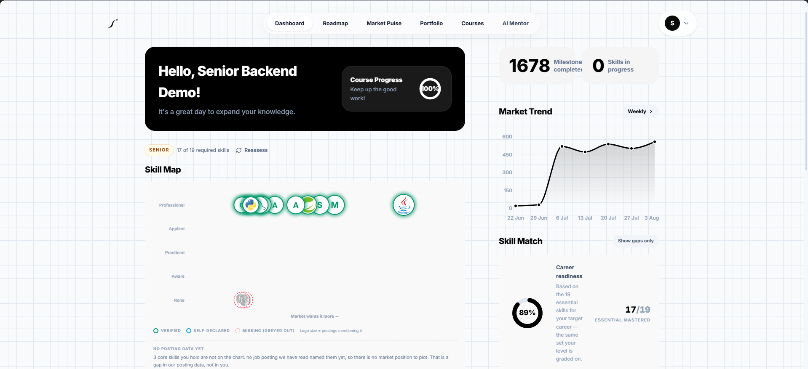
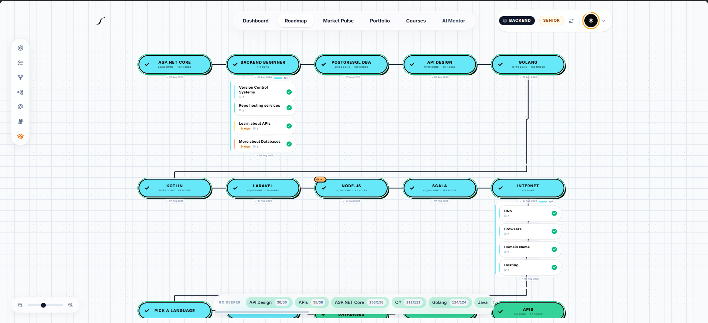
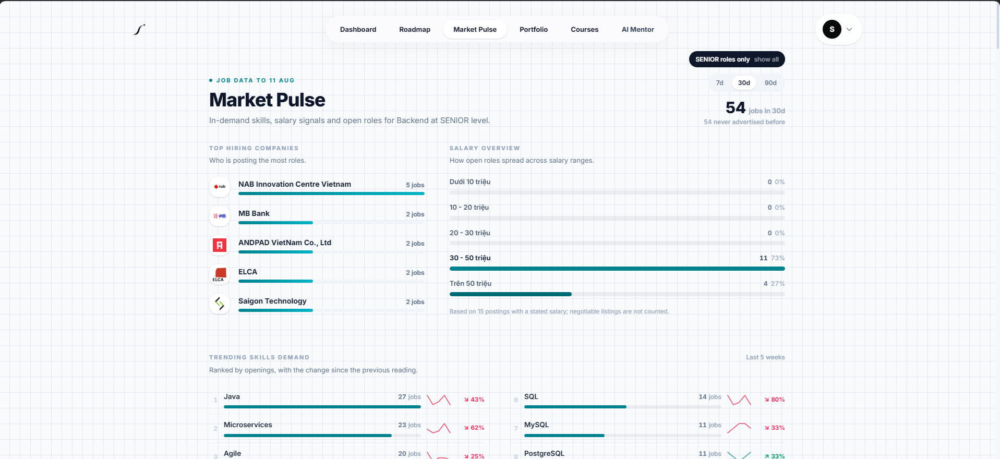
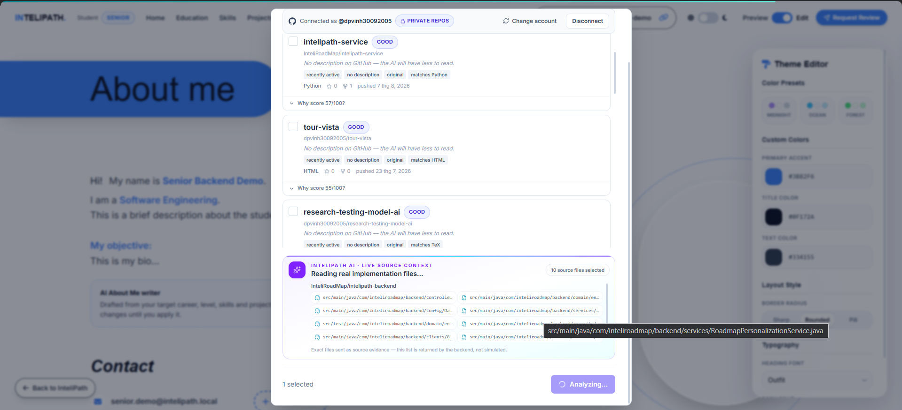
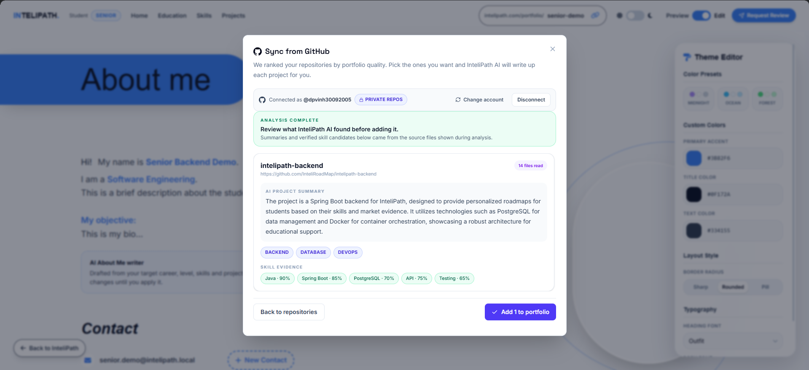
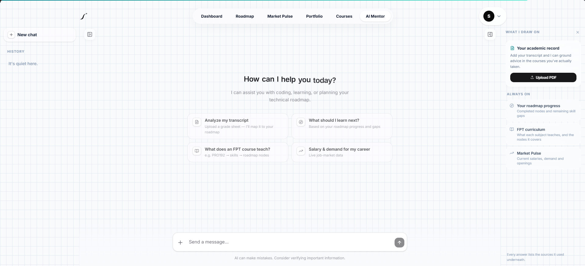
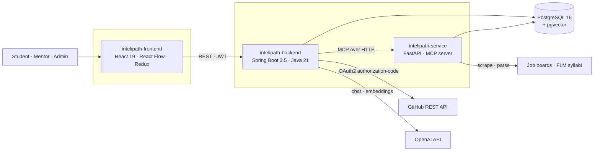
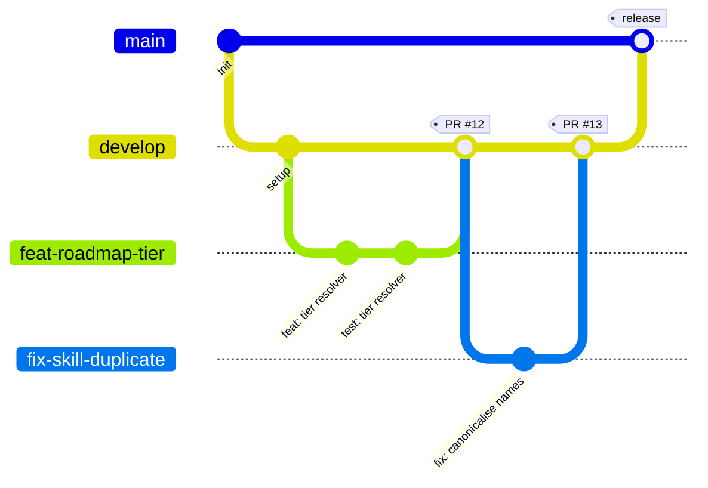
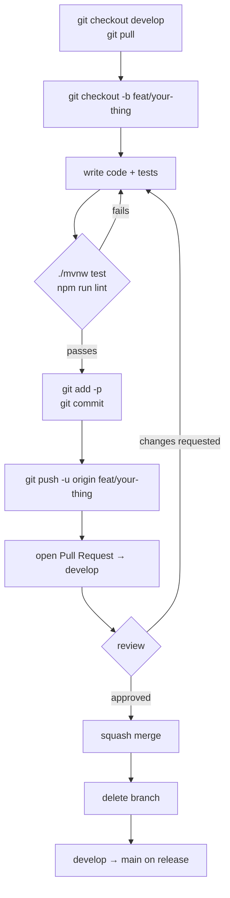

<div align="center">

# InteliPath

**A career roadmap that reads what a student has actually done — not what they say they can do.**

[](https://intelipath.online)
[](https://github.com/InteliRoadMap/intelipath-backend)
[](https://github.com/InteliRoadMap/intelipath-frontend)
[](https://github.com/InteliRoadMap/intelipath-service)

</div>

---

## The problem

A first-year and a final-year student open the same Java roadmap and see the same 71 items. Nothing in it knows what the reader has already built, and nothing in it knows what the market is hiring for this month.

## What InteliPath does

It builds the path from one person's own evidence — GitHub repositories they **actually committed to**, declared skills, and a quiz generated from those same skills — then holds the result against job postings that are open right now.

The system verifies authorship against the repository's contributor list before a repo counts. A fork with no commits does not count.

---

## Screens



### Dashboard

A skill map placing every skill on two axes at once: how well the student holds it, and how often the market asks for it. The logo size is the number of postings that named it. Greyed-out entries are skills the student claims but no posting has mentioned — and the page says so plainly rather than hiding the gap.



### Roadmap

The path itself. Which nodes open and which stay locked is computed from measured ability, not from position in the tree, so two students targeting the same role rarely see the same graph.



### Market Pulse

Live demand for the student's target role and level: who is hiring, how the open roles spread across salary bands, and which skills are moving week to week. Salary figures are drawn only from postings that stated one — negotiable listings are excluded and the count is shown.



### GitHub evidence

Repositories are ranked for portfolio quality, then the AI reads the **actual source files** — the panel lists every file it opened, returned by the backend rather than simulated — before it will credit a skill.

| | |
|---|---|
|  |  |
| **Reading real implementation files** | **Skills backed by what it read** |

### AI Mentor

Answers grounded in the student's own record — roadmap progress, FPT curriculum, live market data, and an optional transcript. Every answer lists the sources it used.



---

## Architecture



**The backend owns every decision.** The Python service reads and extracts; it concludes nothing. The frontend redraws what the backend computed, so when a result is wrong there is exactly one place to open.

---

## Repositories

| Repository | What it is | Stack |
|---|---|---|
| [intelipath-backend](https://github.com/InteliRoadMap/intelipath-backend) | REST API, domain logic, authentication, AI layer | Java 21, Spring Boot 3.5, Spring AI, PostgreSQL, Flyway, Docker |
| [intelipath-frontend](https://github.com/InteliRoadMap/intelipath-frontend) | Web client, roadmap graph, dashboards | React 19, TypeScript, Vite, Tailwind, Redux Toolkit, React Flow |
| [intelipath-service](https://github.com/InteliRoadMap/intelipath-service) | Job-posting and syllabus ingestion, exposed to the backend as MCP tools | Python, FastAPI, FastMCP, BeautifulSoup, Selenium, MarkItDown |
| [infrastructure](https://github.com/InteliRoadMap/infrastructure) | Docker Compose orchestration and nginx for the whole stack | Docker, nginx |

---

## Team

| Member | Role |
|---|---|
| **Đặng Phước Vinh** | Team Leader · Backend · AI |
| **Lê Trương Thanh Hậu** | Backend · Database |
| **Phạm Nguyễn Minh Trí** | Frontend |
| **Nguyễn Như Ý** | Frontend |

---

## Tech stack

### Backend — `intelipath-backend`

| Layer | Choices |
|---|---|
| Language & runtime | Java 21 |
| Framework | Spring Boot 3.5, Spring MVC, Spring Data JPA, Hibernate |
| Security | Spring Security, JWT, OAuth2 authorization-code (GitHub, Google), AES-256-GCM at rest, per-user rate limiting |
| Data | PostgreSQL 16, pgvector, Flyway migrations |
| AI | Spring AI, OpenAI API, RAG over pgvector, LLM tool calling, MCP client |
| Build & run | Maven, Docker, Linux VPS |
| Testing | JUnit |

### Frontend — `intelipath-frontend`

| Layer | Choices |
|---|---|
| Language | TypeScript |
| Framework | React 19, Vite |
| Styling | Tailwind CSS, Radix UI, `class-variance-authority` |
| State & data | Redux Toolkit, Axios, `jwt-decode` |
| Roadmap graph | React Flow (`@xyflow/react`) with `dagre` layout |
| Motion | GSAP, Motion |
| Icons | Lucide, Phosphor, Devicon |

### Service — `intelipath-service`

| Layer | Choices |
|---|---|
| Language | Python |
| Framework | FastAPI, Uvicorn |
| Protocol | FastMCP — the service is exposed to the backend as MCP tools |
| Extraction | BeautifulSoup, Selenium, `curl_cffi`, MarkItDown |
| Data & AI | SQLAlchemy, psycopg2, OpenAI |

---

## Where the project stands

Measured from the repository and the production database — not estimates.

| | |
|---|---|
| REST endpoints | **137** across 22 controllers |
| JPA entities | **42** |
| Flyway migrations | **20** |
| Domain components (dependency-free, unit-testable) | **31** |
| Test classes / `@Test` methods | **52** / **330** |
| Job postings parsed by the LLM | **913** |
| Skill nodes in the catalog | **4,177** |
| Skill ↔ posting links | **5,660** |

---

## Git workflow

Every change reaches `main` through a pull request. Nobody pushes to `main` directly.

<!-- Branch ids are written with a dash here (feat-roadmap-tier) rather than the
     real slash (feat/roadmap-tier). Mermaid's gitGraph parser has choked on
     slashes in branch identifiers, and a diagram that fails to render on the
     organisation landing page is worse than one that is slightly abbreviated.
     The naming convention itself is in the table below. -->



### Branches

| Branch | Purpose |
|---|---|
| `main` | Deployed. Protected. Only receives merges from `develop`. |
| `develop` | Integration branch. Feature branches merge here first. |
| `feat/<slug>` | One feature. Branched from `develop`. |
| `fix/<slug>` | One bug. Branched from `develop`. |
| `chore/<slug>` | Tooling, dependencies, docs. |

### The push flow



### Commit messages

Conventional Commits, one logical change per commit.

```
feat(roadmap): compute node visibility from measured ability
fix(skill): share one canonicaliser across all three write paths
test(assessment): cover the tie-break in paper scoring
chore(deps): bump spring-ai to 1.1.8
docs(readme): document the MCP tool surface
```

### Rules

- **Never push to `main`.** Release goes `develop` → `main` through a PR.
- **Rebase your branch on `develop` before opening the PR**, so the PR diff is only your change.
- **A PR that changes behaviour changes a test.** If nothing needed a test, say why in the description.
- **Never commit secrets.** `.env`, API keys and tokens stay out of the repository — `application.yaml` reads them from the environment.
- **Migrations are append-only.** Never edit a Flyway file that has run anywhere; add a new one.

---

<div align="center">

Built by four Software Engineering students at **FPT University HCMC**.

[intelipath.online](https://intelipath.online)

</div>
